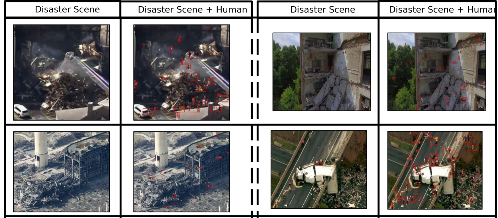
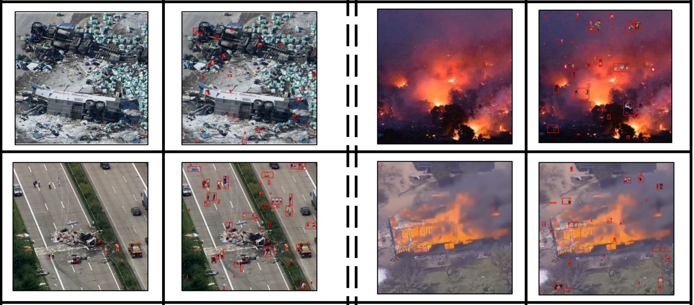
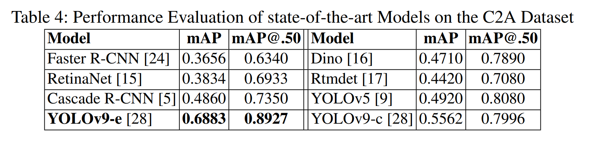
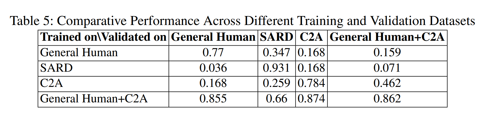

# C2A dataset + paper

### Quick overwiev

__C2A__ is a synthetic dataset that combines humans images pasted into disaster scenarios. 

### Stats:
- 10215 images
- 360 000 humans 
- size from 123X152 to 5184X3456
- median image widdth 428px
- 47% are less than 10px

### Models

- trained with NVIDIA A100,
- batch size 24
- img res 640px
- 50 epochs
- ADAM optimizer
 
results:

### Compariosn with other datasets

They done analysis of different datasets and model performance.

Interestingly when they trained on general human (combination of crowd human, tiny person and VisDrone) the results were the best and also they were more general -> model worked well in different contexts