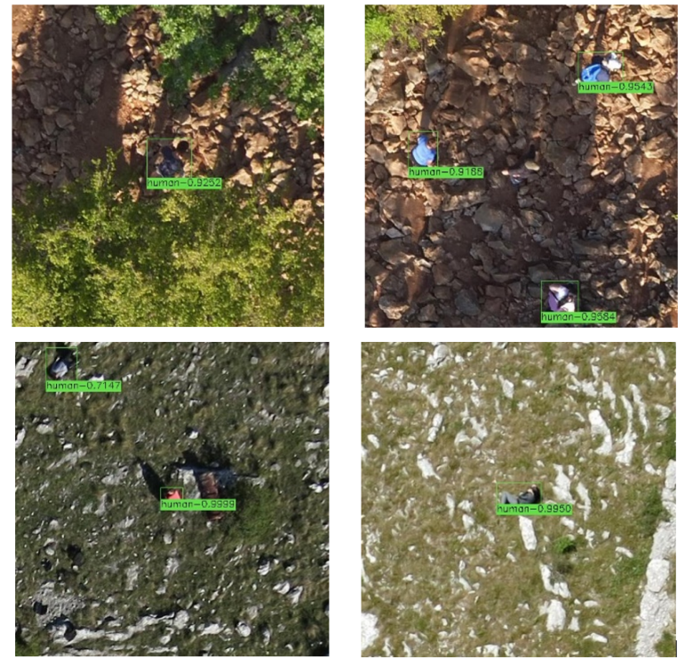

# HERIDAL

### Overwiev 

HERDIAL:
- humans from drone (quite high altitude)
- 1600 images
- 4000x3000 resolution

### Paper

It's quite old for CV standars (2021)

This paper describes training model on Heridal dataset. They firstly preprocessed dataset. Out of 4000x3000 images they generated 512X512. They ignored humans less than 10x10 pixels. 

They finally had 3000 train and val images with 512 resolution. 

test1
 - Params: parameters of batch size 32, epoch 50, a step of 1000
and a learning rate of 0.001.
- result:  91.27% mAP (Mean
Average Precision) using RMSprop optimizer

test2
- params:  size 4, epoch 50, a step
of 1000 and a low learning rate compared to the above experiment
as 0.0001
- result: 93.29%mAP

"But to train the dataset with image
resolution of more than 512 × 512 a huge amount of GPU memory
is required"

Conclusions:
they used EfficientDET architecture not YOLO, but it was 5 years ago. Slicing to get smaller images is important. 

Example images:
