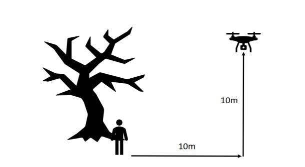
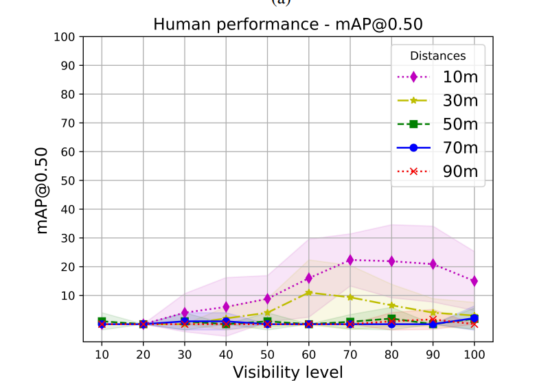
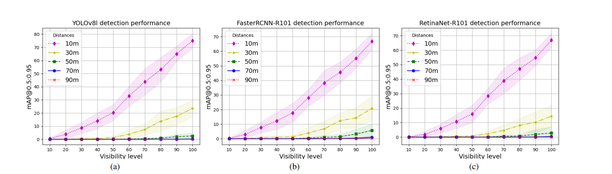
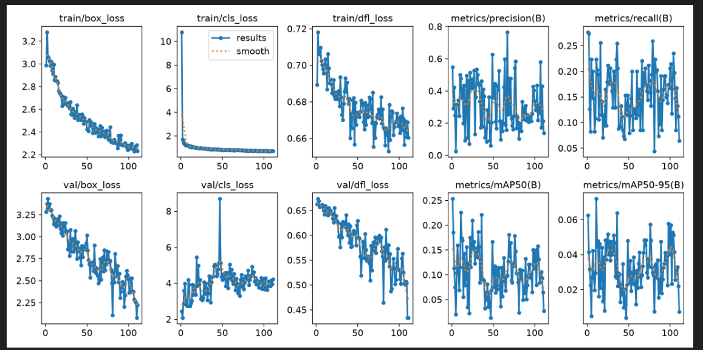
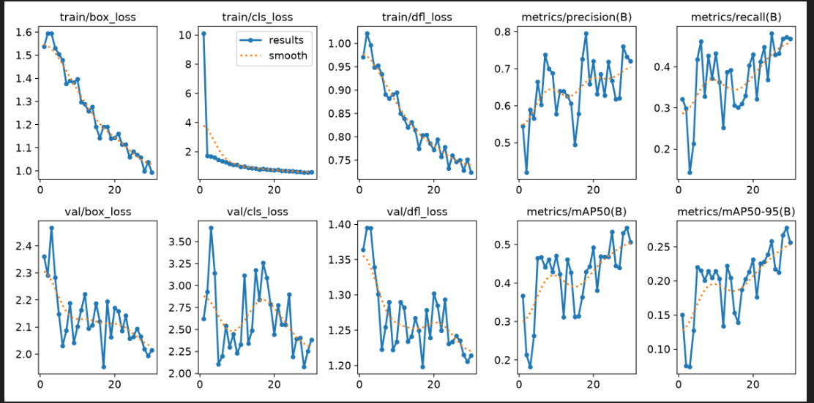
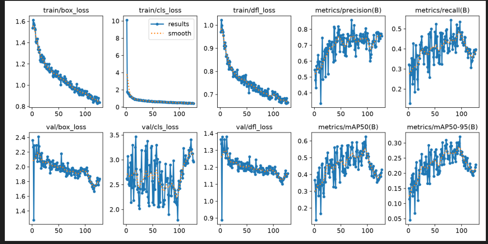
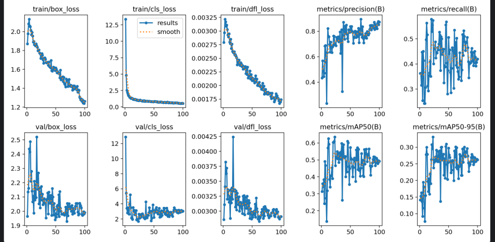
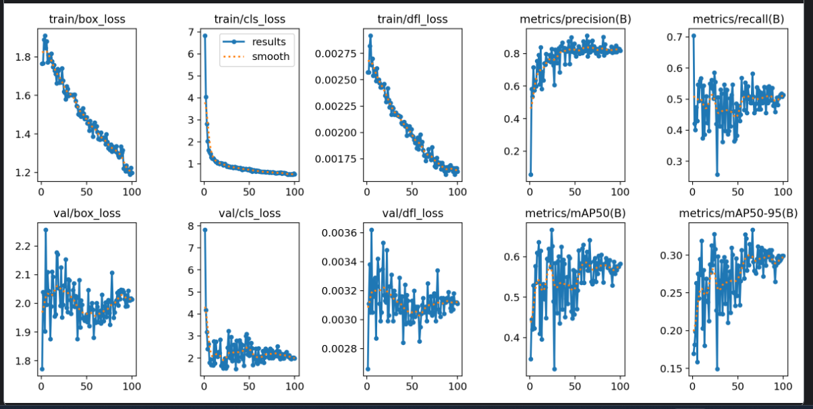
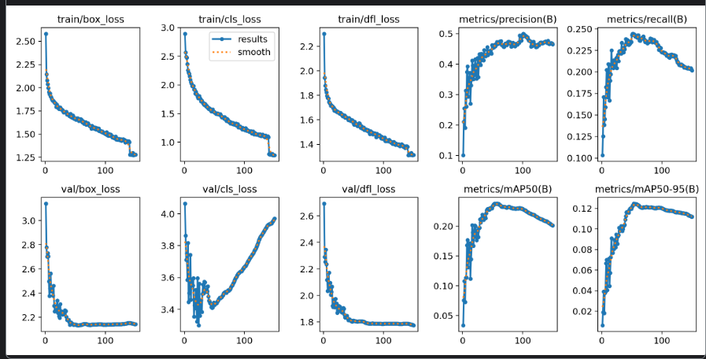

# NOMAD

### Key parameters

- 10 levels of occlusion
- natural/man-made scenery
- 5 height level (10/30/50/70/90) meters

### Other datasets mentioned
- HERIDAL 1600 images
- WISARD dataset ~28000 images (also thermovision)

### locations:
- The 12 locations included: 3 different Schools, 2
paintball courts, 1 forest park, 1 golf course, 1 lake shore,
1 quarry, 2 farms, and 1 AMA flying field.

### human positions:
- Starting Frame: With few exceptions, the first frame
represented a view of the actor completely visible.
- Hiding: All actors were instructed to hide behind their
obstacle two times, with small variations in their hiding trajectory. This step allowed us to obtain varying
degrees of occluded aerial views.
- Laying: To provide a variety of poses, actors were
asked to lay down when completely visible and when
partially occluded by their obstacle.
- Walking: Finally, actors performed a small walking
trajectory at the end of their routine.

"actors were given a 20$USD prepaid card"

### Labeling
"All 42,825 selected frames were sent to Labelbox [44], a
labelling company who employed expert annotators to add
bounding boxes and visibility labels to all images."

### Some models results (not trained on NOAMD)

### My approach so far

- first attempt with downscalling images to 1024px on 1/10 NOMAD dataset -> failure: P/R 0.47813/0.22353, best result at 11 epoch, the sizes of humans are so tiny when compressing images that the model is completely helpless. 

- second attempt: dataset sliced to 1024px pieces with 30/70 human/background ratio. 30 epochs training, best results at epoch 29: P/R -> 0.73227,0.47185. The approach with slicing showed potential

- thrid attempt: 150 epochs with patience=30, best result 97 epoch, P/R -> 0.80506,0.53509, this run showed not so bad results and that ~100 epochs is probably needed for training, this is still 1/10 NOMAD dataset

This three aproaches all were on YOLO8s. Then I moved to kaggle as it provides more GPU power than my laptop.

- fourth attempt: YOLO26n on kaggle, comparable results, 

- fifth attempt: modified dataset, discarding more background new proprtions 10% background, results also quite similar, best: 0.813      0.579

-sixth attempt: on whole 9/10 NOMAD training on kaggle, yolo26n, failure due to time limit exceeded, 88 epochs in 12h, results complete failure, the model was overfitting and achived best results at 25 epoch

-seventh attempt: on whole NOMAD with 512px tiles, YOLO26s with P2 layer, 9h training time, results:

I think the NOMAD is too hard when including occluded images, it's hard for the model to learn if the boxes are so tiny
### Current slcing algorithm and possible improvements

Currently it's sliding window so if the actor is at the edges it can lead to minimal boxes, especially as NOMAD has this occlusions that make it even more probable and are main obstacle for the model probably. 

To consider, make the algoritm choose tile with actor based on label so it nver lays at the edges and background tile choose more randomly.

Also mabe go to 512px instead of 1024px for training speed. (8gb -> 3gb)