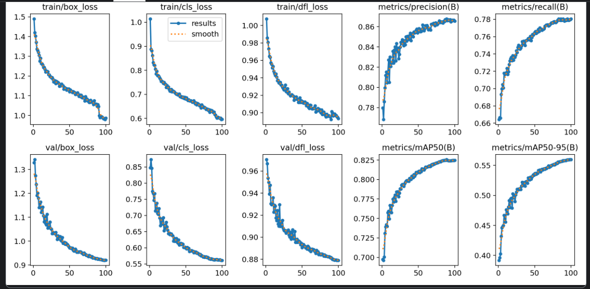

# C2A + SARD

Training YOLO11s first on C2A then fine-tuning on SARD.

__Phase 1:__

```python
from ultralytics import YOLO

model = YOLO('yolo11s.pt') 

results = model.train(
    data='/kaggle/working/data.yaml',
    epochs=100,             
    imgsz=640,              
    batch=16,              
    device=[0,1],               
    patience=20,           
    save=True,             
    project='Phase1_C2A',   
    name='yolo11s_pretrain',
    lr0=0.01,               # High initial learning rate for broad feature extraction
    optimizer='auto',       # Let Ultralytics pick the best optimizer (usually AdamW)
)
```

On C2A very good results:



__Phase_2__

Fine-tuning on SARD:
```python
from ultralytics import YOLO
phase1_weights = '/kaggle/input/models/bartoszkrolik/yolo-c2a/pytorch/default/1/best (1).pt'
model = YOLO(phase1_weights) 

print("Starting Phase 2 Fine-Tuning...")
results = model.train(
    data='/kaggle/working/sard_data.yaml',
    epochs=50,              
    imgsz=640,              
    batch=16,               
    device=[0,1],               
    patience=15,            
    save=True,              
    project='Phase2_SARD',  
    name='yolo11s_finetune',
    lr0=0.001,              # 10x smaller than Phase 1 to preserve C2A features
    warmup_epochs=0.0,      # Disable warmup since the model is already trained       
)
```

__Results__

Checked on test parts of datasets that weren't used for training or validation during training.

```bash
Class     Images  Instances      Box(P          R      mAP50  mAP50-95): 100% ━━━━━━━━━━━━ 36/36 3.8it/s 9.5s0.2s
                   all        570        732      0.961      0.862      0.932      0.632
Speed: 1.5ms preprocess, 8.9ms inference, 0.0ms loss, 1.3ms postprocess per image
```

.jpg>)

__Analysis__

Very good results on both datasets, but the SARD is pretty close to people, that mostly are fully visible and quite easily can be seen by human. I wanted to test on sample from NOMAD dataset to check if there is some transef between C2A, SARD and NOMAD. I choose my 512px sliced NOMAD, as it is the nearest to 640px this model was trained on. 

```bash
#Results:
Class     Images  Instances      Box(P          R      mAP50  mAP50-95): 100% ━━━━━━━━━━━━ 345/345 6.8it/s 50.6s0.1ss
                   all       5505       3645      0.166      0.133     0.0584     0.0288
Speed: 0.6ms preprocess, 6.0ms inference, 0.0ms loss, 0.7ms postprocess per image
```

.jpg>)

__Analysis__

On the NOMAD model trained on C2A and SARD is completely helpless. Humans are so small that recall and precision are under 20%, as the photo shows model mistakes humans with trees for example. However the level of occlusion on most of this NOMAD photos made it even very hard for human to find the person on the image, especially when hidding. 